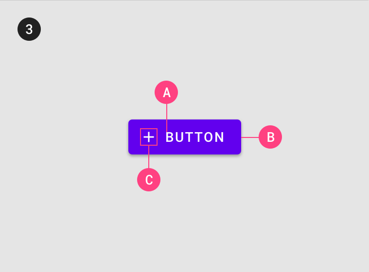

<!--docs:
title: "Buttons"
layout: detail
section: components
excerpt: "Flutter Buttons usage document"
ide_version: "<cIDE name> <compatible IDE version and build number>"
material_package_version: "<compatible Material platform package version number>"
iconId:
path: /
api_doc_root:
-->

# Buttons

[Buttons](https://material.io/components/buttons/) allow users to take actions, and make choices, with a single tap.

There are four types of buttons:

1. [Text button](#text-button)
1. [Outlined button](#outlined-button)
1. [Contained button](#contained-button)
1. [Toggle button](#toggle-button)


## Using buttons

Before you can use Material buttons, you need to import the Material Components package for Flutter: `package:flutter/material.dart`.

You need to be using a [`MaterialApp`](https://api.flutter.dev/flutter/material/MaterialApp-class.html).

For more information on getting started with the Material for Flutter, go to the Flutter [Material library](https://api.flutter.dev/flutter/material/material-library.html) page.

### Making buttons accessible

Flutter's APIs support accessibility setting for large fonts, screen readers, and sufficient contrast. For more information, go to Flutter's [accessibility](https://flutter.dev/docs/development/accessibility-and-localization/accessibility) and [internationalization](https://flutter.dev/docs/development/accessibility-and-localization/internationalization) pages.

Flutter's button component also supports component labeling...\<developers need to insert information on label setting\>

For more guidance on writing labels, go to [our page on how to write a good accessibility label](https://material.io/design/usability/accessibility.html#writing).

## Text button

[Text buttons](https://material.io/components/buttons/#text-button) are typically used for less-pronounced actions, including those located in dialogs and cards. In cards, text buttons help maintain an emphasis on card content.

### Text button examples

API and source code:
* `FlatButton`
    * [Class description](https://api.flutter.dev/flutter/material/FlatButton-class.html)
    * [GitHub source](https://github.com/flutter/flutter/blob/master/packages/flutter/lib/src/material/flat_button.dart)

The following example shows a text button with a text label.


```dart
FlatButton(
    textColor: Color(0xFF6200EE),
    onPressed: () {
        // Respond to button press
    },
    child: Text("TEXT BUTTON"),
)
```

<details>
<summary><b>Adding an icon to a text button</b></summary>
<br>
    
The following example shows a text button with an icon.


```dart
FlatButton.icon(
    textColor: Color(0xFF6200EE),
    onPressed: () {
        // Respond to button press
    },
    icon: Icon(Icons.add, size: 18),
    label: Text("TEXT BUTTON"),
)
```

</details>

### Anatomy and key properties

A text button has a text label, a transparent container and an optional icon.


<details>
<summary><b>Text label</b> properties</summary>
<br>
    
// TODO: Fill out text button text label properties

|  | Property |
| --- | --- |
| **Text label** |  |
| **Color** |  |
| **Typography** |  |

</details>

<details>
<summary><b>Container</b> properties</summary>
<br>
    
// TODO: Fill out text button container properties

|  | Property |
| --- | --- |
| **Color** |  |
| **Stroke color** |  |
| **Stroke width** |  |
| **Shape** |  |
| **Elevation** |  |
| **Ripple color** |  |

</details>

<details>
<summary><b>Icon</b> properties</summary>
<br>
    
// TODO: Fill out text button icon properties

|  | Property |
| --- | --- |
| **Icon** |  |
| **Color** |  |
| **Size** |  |
| **Gravity** (position relative to text label) |  |
| **Padding** (space between icon and text label) |  |

</details>

<details>
<summary><b>Styles</b></summary>
<br>

// TODO: Add text button styles/themes (or remove this section if n/a)

</details>

## Outlined button

[Outlined buttons](https://material.io/components/buttons/#outlined-button) are medium-emphasis buttons. They contain actions that are important, but aren’t the primary action in an app.

### Outlined button examples

API and source code:

* `OutlineButton`
    * [Class definition](https://api.flutter.dev/flutter/material/OutlineButton-class.html)
    * [GitHub source](https://github.com/flutter/flutter/blob/master/packages/flutter/lib/src/material/outline_button.dart)


```dart
OutlineButton(
    textColor: Color(0xFF6200EE),        
    highlightedBorderColor: Colors.black.withOpacity(0.12),
    onPressed() {
        // Respond to button press
    },
    child: Text("OUTLINED BUTTON"),
)
```

<details>
<summary><b>Adding an icon to an outlined button</b></summary>
<br>

The following example shows an outlined button with an icon.


```dart
OutlineButton.icon(
    textColor: Color(0xFF6200EE),
    highlightedBorderColor: Colors.black.withOpacity(0.12),
    onPressed: () {
        // Respond to button press
    },
    icon: Icon(Icons.add, size: 18),
    label: Text("OUTLINED BUTTON"),
)
```

</details>

### Anatomy and key properties

An outlined button has a text label, a stroked container and an optional icon.


<details>
<summary><b>Text label</b> properties</summary>
<br>

// TODO: Fill out outlined button text label properties

|  | Property |
| --- | --- |
| **Text label** |  |
| **Color** |  |
| **Typography** |  |

</details>

<details>
<summary><b>Container</b> properties</summary>
<br>
    
// TODO: Fill out outlined button container properties

|  | Property |
| --- | --- |
| **Color** |  |
| **Stroke color** |  |
| **Stroke width** |  |
| **Shape** |  |
| **Elevation** |  |
| **Ripple color** |  |

</details>

<details>
<summary><b>Icon</b> properties</summary>
<br>
    
// TODO: Fill out outlined button icon properties

|  | Property |
| --- | --- |
| **Icon** |  |
| **Color** |  |
| **Size** |  |
| **Gravity** (position relative to text label) |  |
| **Padding** (space between icon and text label) |  |

</details>

<details>
<summary><b>Styles</b></summary>
<br>

// TODO: Add outlined button styles/themes (or remove this section if n/a)

</details>

## Contained button

[Contained buttons](https://material.io/components/buttons/#contained-button) are high-emphasis, distinguished by their use of elevation and fill. They contain actions that are primary to your app.

### Contained button examples

API and source code:

* `RaisedButton`
    * [Class definition](https://api.flutter.dev/flutter/material/RaisedButton-class.html)
    * [GitHub source](https://github.com/flutter/flutter/blob/master/packages/flutter/lib/src/material/raised_button.dart)

The following example shows a contained button with a text label and a filled container.


```dart
RaisedButton(
    textColor: Colors.white,
    color: Color(0xFF6200EE),
    onPressed: () {
        // Respond to button press
    },
    child: Text('CONTAINED BUTTON'),
)
```

<details>
<summary><b>Adding an icon to a contained button</b></summary>
<br>

The following example shows a contained button with an icon.


```dart
RaisedButton.icon(
    textColor: Colors.white,
    color: Color(0xFF6200EE),
    onPressed: () {
        // Respond to button press
    },
    icon: Icon(Icons.add, size: 18),
    label: Text("CONTAINED BUTTON"),
)
```

</details>

### Anatomy and key properties

A contained button has a text label, a filled container and an optional icon.



<details>
<summary><b>Text label</b> properties</summary>
<br>
    
// TODO: Fill out contained button text label properties

|  | Property |
| --- | --- |
| **Text label** |  |
| **Color** |  |
| **Typography** |  |

</details>

<details>
<summary><b>Container</b> properties</summary>
<br>
    
// TODO: Fill out contained button container properties

|  | Property |
| --- | --- |
| **Color** |  |
| **Stroke color** |  |
| **Stroke width** |  |
| **Shape** |  |
| **Ripple color** |  |

</details>

<details>
<summary><b>Icon</b> properties</summary>
<br>
    
// TODO: Fill out contained button icon properties

|  | Property |
| --- | --- |
| **Icon** |  |
| **Color** |  |
| **Size** |  |
| **Gravity** (position relative to text label) |  |
| **Padding** (space between icon and text label) |  |

</details>

<details>
<summary><b>Styles</b></summary>
<br>

// TODO: Add contained button styles/themes (or remove this section if n/a)

</details>

## Toggle button

[Toggle buttons](https://material.io/components/buttons/#toggle-button) can be used to select from a group of choices.

There are two types of toggle buttons:

* [Toggle button](#toggle-button)
* [Icon](#icon)

### Toggle button

To emphasize groups of related toggle buttons, a group should share a common container.

#### Toggle button examples

API and source code:

* `ToggleButtons`
    * [Class definition](https://api.flutter.dev/flutter/material/ToggleButtons-class.html)
    * [GitHub source](https://github.com/flutter/flutter/blob/master/packages/flutter/lib/src/material/toggle_buttons.dart)

The following example shows a toggle button with three buttons that have text labels.


In the state:
```dart
final isSelected = <bool>[false, false, false];
```

In the widget hierarchy:
```dart
ToggleButtons(
    color: Colors.black.withOpacity(0.60),
    selectedColor: Color(0xFF6200EE),
    selectedBorderColor: Color(0xFF6200EE),
    fillColor: Color(0xFF6200EE).withOpacity(0.08),
    splashColor: Color(0xFF6200EE).withOpacity(0.12),
    hoverColor: Color(0xFF6200EE).withOpacity(0.04),
    borderRadius: BorderRadius.circular(4.0),
    constraints: BoxConstraints(minHeight: 36.0),
    isSelected: isSelected,
    onPressed: (index) {
        // Respond to button selection
        setState(() {
            isSelected[index] = !isSelected[index];
        });
    },
    children: [
        Padding(
            padding: EdgeInsets.symmetric(horizontal: 16.0),
            child: Text('BUTTON 1'),
        ),
        Padding(
            padding: EdgeInsets.symmetric(horizontal: 16.0),
            child: Text('BUTTON 2'),
        ),
        Padding(
            padding: EdgeInsets.symmetric(horizontal: 16.0),
            child: Text('BUTTON 3'),
        ),
    ],
)
```

<details>
<summary><b>Implementing an icon-only toggle button</b></summary>
<br>

The following example shows a toggle button with three buttons that have icons.


```dart
ToggleButtons(
    color: Colors.black.withOpacity(0.60),
    selectedColor: Color(0xFF6200EE),
    selectedBorderColor: Color(0xFF6200EE),
    fillColor: Color(0xFF6200EE).withOpacity(0.08),
    splashColor: Color(0xFF6200EE).withOpacity(0.12),
    hoverColor: Color(0xFF6200EE).withOpacity(0.04),
    borderRadius: BorderRadius.circular(4.0),
    isSelected: isSelected,
    onPressed: (index) {
        // Respond to button selection
        setState(() {
            isSelected[index] = !isSelected[index];
        });
    },
    children: [
        Icon(Icons.favorite),
        Icon(Icons.visibility),
        Icon(Icons.notifications),
    ],
)
```

</details>

#### Anatomy and key properties

A toggle button has a shared stroked container, icons and/or text labels.


<details>
<summary><b>Selection</b> properties</summary>
<br>

|  | Property |
| --- | --- |
| **Single selection** |  |
| **Selection required** |  |

</details>

<details>
<summary><b>Styles</b></summary>
<br>

// TODO: Add toggle button styles/themes (or remove this section if n/a)

</details>

### Icon

Icons can be used as toggle buttons when they allow selection, or deselection, of a single choice, such as marking an item as a favorite.

#### Icon example

API and source code:

* `IconButton`
    * [Class definition](https://api.flutter.dev/flutter/material/IconButton-class.html)
    * [GitHub source](https://github.com/flutter/flutter/blob/master/packages/flutter/lib/src/material/icon_button.dart)

The following example shows an icon that can be used independently or in items of a `GridView`.


In the state:
```dart
var isSelected = false;
var icon = Icons.favorite_border;
```

In the widget hierarchy:
```dart
IconButton(
    icon: Icon(icon),
    color: Colors.white,
    onPressed: () {
        // Respond to icon toggle
        setState(() {
            isSelected = !isSelected;
            icon = isSelected ? Icons.favorite : Icons.favorite_border;
        });
    },
)
```

## Theming buttons

Buttons support [Material Theming](https://material.io/components/buttons/#theming) and can be customized in terms of color, typography and shape.

### Button theming example

// TODO: Fill out button theming example(s)
