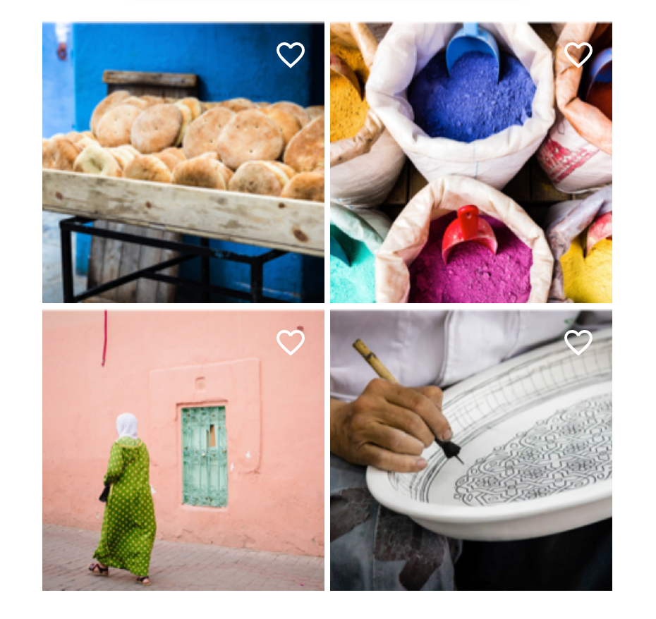

<!--docs:
title: "Buttons"
layout: detail
section: components
excerpt: "Web Buttons"
ide_version: "<cIDE name> <compatible IDE version and build number>"
material_package_version: "<compatible Material platform package version number>"
iconId:
path: /:
api_doc_root:
-->

# Buttons

[Buttons](https://material.io/components/buttons/) allow users to take actions, and make choices, with a single tap.

There are four types of buttons:

1. [Text button](#text-button)
2. [Outlined button](#outlined-button)
3. [Contained button](#contained-button)
4. [Toggle button](#toggle-button)


## Using buttons

Before you can use a button, you will need to install to:

* Install the button component.
* Import the button definiton.

See the [Quick start](https://github.com/material-components/material-components-web-components/blob/master/README.md#quick-start) for more information on using MWC components in your project.

For example, you may need to make changes to your build and dev server to work with MWC.


### Install the Material button component

Install `mwc-button` (for text, outlined, or contained button) or `mwc-icon-button-toggle` (for the icon toggle button) before including the component in your source.

**`mwc-button`**
```bash
npm install @material/mwc-button
```

**`mwc-icon-button-toggle`**
```bash
npm install @material/mwc-icon-button-toggle
```

### Import the button definition

You'll need to import the JavaScript definitions for the buttons you use.

#### To import the button definitons

```js
// The following line applies to the mwc-button component
import '@material/mwc-button';

// The followign line applies to the mwc-icon-button-toggle component
import '@material/mwc-icon-button-toggle';
```

### Add an icon to `mwc-button`

Add an icon to your `mwc-button` instance using the following steps:

1. In your HTML file, reference the icon font library you would like to use (we recommend the [Material Icons](https://material.io/tools/icons/) from Google Fonts):
    ```html
    <head>
      <link rel="stylesheet" href="https://fonts.googleapis.com/icon?family=Material+Icons">
    </head>
    ```
1.  If you're using a an icon font other than the default Material Icons, set the `--mdc-icon-font` property.

    ```html
    <style>
    html {
      --mdc-icon-font: 'My Icon Font';
    }
    </style>

1. Add the `icon` or `trailingIcon` attribute to your button. Use the icon name as the attribute value.

    **Example using [Material Icons](https://material.io/tools/icons/)**

    ```HTML
    <mwc-button icon="favorite" label="Button"></mwc-button>
    <mwc-button trailingIcon="favorite" label="Button with trailing icon"></mwc-button>
    ```

    To add an icon using an `` or `<svg>` tag, put the tag inside the `<mwc-button>` and add the `slot="icon"` attribute (or `slot="trailingIcon" for a trailing icon).

    **Example using SVG Icons**

    ```html
    <mwc-button label="Button">
      <svg slot="icon" aria-hidden="true" viewBox="...">
        /*...*/
      </svg>
    </mwc-button>
    ```

### Making buttons accessible

Material Design spec advises that touch targets should be at least 48 x 48 px.
To meet this requirement, add the following to your button:

<!-- Blocked on  https://github.com/material-components/material-components-web-components/issues/976 -->

### Styling buttons with custom properties

Use CSS custom properties to customize the look and feel of your buttons. 

See the [Theming guide](../theming.md) for more information.

## Text button

[Text buttons](https://material.io/components/buttons/#text-button) are typically used for less-pronounced actions, including those located in dialogs and cards. In cards, text buttons help maintain an emphasis on card content.

### Text button example

API and source code:

* `mwc-button`
    * [API](https://github.com/material-components/material-components-web-components/blob/master/packages/button/README.md)
    * [Demo](https://glitch.com/~many-witty-chihuahuas)
    * [Source code](https://github.com/material-components/material-components-web-components/tree/master/packages/button/src)


```html
<mwc-button label="Text Button"></mwc-button>
```

Text button with icon example:


```html
<mwc-button icon="bookmark label="Text Button plus icon"></mwc-button>
```


### Anatomy and key properties

A text button has a text label, a transparent container and an optional icon.


1. Text label
1. Container
1. Icon

#### Text label attributes

Design Attribute | Theme value | HTML attribute | CSS property 
---|---|---|---
Text label | N/A | `label` | N/A 
Text color | Primary color | N/A | None (can override `--mdc-theme-primary`)
Typography | Default button text style | N/A | `--mdc-typography-font-family`, `--mdc-typography-button-*`

For details on the available typography properties, see [Typography properties](../theming#typography-properties) in the Theming guide.

#### Container attributes

Design Attribute | Theme value | CSS property
---|---|---
Ripple color | Primary color at 16% opacity | None (can override `--mdc-theme-primary`)

#### Icon attributes


 Design Attribute | Theme value | HTML attribnute | CSS property
---|---|---|---
 Icon | N/A | `icon` | N/A
Icon color | Primary color | N/A | None (can override `--mdc-theme-primary`)


## Outlined button

[Outlined buttons](https://material.io/components/buttons/#outlined-button) are medium-emphasis buttons. They contain actions that are important, but aren’t the primary action in an app.

API and source code:

* `mwc-button`
    * [API](https://github.com/material-components/material-components-web-components/blob/master/packages/button/README.md)
    * [Demo](https://glitch.com/~many-witty-chihuahuas)
    * [Source code](https://github.com/material-components/material-components-web-components/tree/master/packages/button/src)

### Outlined button example


```html
<mwc-button outlined label="Outlined Button"></mwc-button>
```

#### Outlined button with icon example


```html
<mwc-button
  outlined icon="bookmark"
  label="Outlined Button plus Icon">
</mwc-button>
```

### Anatomy and key properties

An outline button has text, a container, and an optional icon.


1. Text label
1. Container
1. Icon


#### Text label attributes

Design Attribute | Theme value | HTML attribute | CSS property
---|---|---|---
Text label | N/A | `label` | N/A
Text color | Primary color | N/A | None (can override `--mdc-theme-primary`)
Typography | Default button text style | N/A | `--mdc-typography-font-family`, `--mdc-typography-button-*`

For details on the available typography properties, see [Typography properties](../theming#typography-properties) in the Theming guide.

#### Container attributes

Design Attribute | Theme value | CSS property
---|---|---
Ripple color | Primary color at 16% opacity | None (can override `--mdc-theme-primary`)
Shape radius | 4px | None
Outline color | Primary color (see note) | `--mdc-button-outline-color`
Outline width | 1px | `--mdc-button-outline-width`
Container width | Automatic | `width` 
Horzontal padding | 16px - outline width | `--mdc-button-horizontal-padding`

Note: The Material design spec calls for the outline to be the on-surface color at 12% opacity.
Currently `mwc-button` defaults to the primary color for outlines.

#### Icon attributes

 Design Attribute | Theme value | HTML attribnute | CSS property
---|---|---|---
 Icon | N/A | `icon` | N/A
Icon color | Primary color | N/A | None (can override `--mdc-theme-primary`)

We recommend using [Material Theming](https://material.io/components/buttons/#theming) to apply your customizations across your application. For a full list of component properties, go to the [`mwc-button` API doc]().

## Contained button

[Contained buttons](https://material.io/components/buttons/#contained-button) are high-emphasis buttons, distinguished by their use of elevation and fill. They contain actions that are primary to your app.

#### Contained button example

API and source code:

* `mwc-button`
    * [API](https://github.com/material-components/material-components-web-components/blob/master/packages/button/README.md)
    * [Demo](https://glitch.com/~many-witty-chihuahuas)
    * [Source code](https://github.com/material-components/material-components-web-components/tree/master/packages/button/src)


```html
<mwc-button raised label="Contained"></mwc-button>
```

#### Contained button with icon example


```html
<mwc-button raised icon="bookmark" label="Contained Button plus Icon"></mwc-button>
```
</details>

### Anatomy and key attributes

A contained button has text, a container, and an optional icon.


1. Text label
1. Container
1. Icon

#### Text label attributes

Design Attribute | Theme value | HTML attribute | CSS property
---|---|---
Text label | N/A | `label` | N/A
Text color | On-primary color | N/A | None (can override `--mdc-theme-on-primary`)
Typography | Default button text style | `--mdc-typography-font-family`, `--mdc-typography-button-*`

For details on the available typography properties, see [Typography properties](../theming#typography-properties) in the Theming guide.

#### Container attributes

Design Attribute | Theme value | CSS Property
---|---|---
Container fill color| Primary color | None (can override `--mdc-theme-primary`)
Ripple color | On-primary color at 32% opacity | None (can override `--mdc-theme-on-primary`)
Shape radius | 4px | None
Container width | Automatic | `width` 
Horzontal padding | 16px | `--mdc-button-horizontal-padding`


#### Icon attributes

 Design Attribute | Theme value | HTML attribute | CSS Property
---|---|---|---
Icon | N/A | `icon` | N/A
Icon color | On-primary color | N/A | None (can override `--mdc-theme-on-primary`)


We recommend using [Material Theming](https://material.io/components/buttons/#theming) to apply your customizations across your application. For a full list of component properties, go to the [contained button API doc]()


## Toggle button

[Toggle buttons](https://material.io/components/buttons/#toggle-button) can be used to select from a group of choices,
or to select or deselect an individual option.

### Toggle button groups

MWC currently **doesn't** support toggle button groups, such as:


If your application needs a toggle button group, you will need to use a different framework such as [Vuetify](https://vuetifyjs.com/en/components/button-groups#button-groups).

### Icon toggle button

Icons can be used as toggle buttons when they allow selection, or deselection, of a single choice, such as marking an item as a favorite.

#### Toggle icon button example with background images

API and source code:

* `mwc-icon-button-toggle`
    * [API](https://github.com/material-components/material-components-web-components/blob/master/packages/icon-button-toggle/README.md)
    * [Demo](https://glitch.com/~many-witty-chihuahuas)
    * [Source code](https://github.com/material-components/material-components-web-components/tree/master/packages/icon-button-toggle/src)




To generate the example with background images of your choosing, you will need containers for your tiled images, and containers to resize your images. You may also need to change the icon color to ensure that the icon is visible on your image (see the `index.css` file for the tiled container \[`container`\] and the image container \[`image-with-fav`\] and the icon button color \[`fave-button`\]).

*   In your JavaScript file, import `mwc-icon-button-toggle`:

    ```js
    import '@material/mwc-icon-button-toggle';
    ```

*   In your HTML file, you can now add the iterations of the following, which shows containers with background images:

    ```html
    <div class="container">
      <div class="image-with-fave">
        
        <mwc-icon-button-toggle
          class="fave-button"                                 
          id="favorite-1"
          onicon="favorite"
          officon="favorite_border"
          aria-label="Add to favorites">
        </mwc-icon-button-toggle>
      </div>
      <div class="image-with-fave">
        
        <mwc-icon-button-toggle
          class="fave-button"        
          id="favorite-2"
          onicon="favorite"
          officon="favorite_border"
          aria-label="Add to favorites">
        </mwc-icon-button-toggle>
      </div>
          ...
    </div>
    ```

#### Anatomy and key properties

The icon button consists of two icons for 'on' and 'off'.


1. Container
1. Icon

 Design Attribute | Theme value | HTML attribute | CSS Property
---|---|---|---
On icon | N/A | `onIcon` | N/A
Off icon | N/A | `offIcon` | N/A
Icon color | Black | N/A | `color`

<!-- In theory I think the icon color _should_ be the on-surface color, but AFAICT 
     it is not controlled by any theme property -->

We recommend using [Material Theming](https://material.io/components/buttons/#theming) to apply your customizations across your application. For a full list of component properties, go to the [Icon button toggle API doc](https://github.com/material-components/material-components-web-components/blob/master/packages/icon-button-toggle/README.md).


### Button theming example

API and source code:

* `mwc-button`
    * [API](https://github.com/material-components/material-components-web-components/blob/master/packages/button/README.md)
    * [Source code](https://github.com/material-components/material-components-web-components/tree/master/packages/button/src)


The following example shows text, outlined and contained button types styled to match the [Shrine theme](https://material.io/design/material-studies/shrine.html).


#### Implementing button theming

This example uses the colors and font family defined by the [Shrine theme](https://material.io/design/material-studies/shrine.html).

```css
html {
  background-color: #fff;
  /* Shrine Pink 100 */
  --mdc-theme-primary: #fedbd0;
  /* Shrine Pink 50 */
  --mdc-theme-secondary: #feeae6;
  /* Shrine Pink 900 used for all text and icons */
  --mdc-theme-on-primary: #442c2e;
  --mdc-theme-on-secondary: #442c2e;
  --mdc-theme-on-surface: #442c2e;
}

mwc-button[raised] {
  --mdc-button-horizontal-padding: 32px;  
}

/* Shrine pink 900 for text and outline buttons */
mwc-button:not([raised]) {
  --mdc-theme-primary: #442c2e;
}
```

