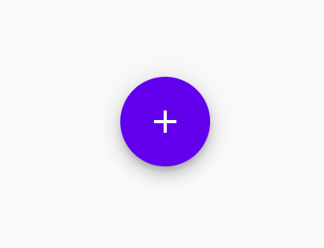
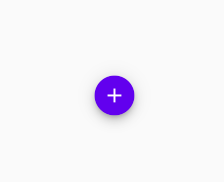
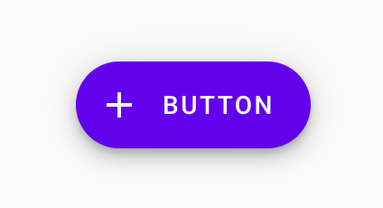

<!--docs:
title: "Floating action button"
layout: detail
section: components
excerpt: "A floating action button (FAB) represents the primary action of a screen."
iconId: 
path: /catalog/floating-action-button/
-->

# Floating action buttons

A floating action button (FAB) represents the primary action of a screen.

## Using FABs

A FAB performs the primary, or most common, action on a screen. It appears in front of all screen content, typically as a circular shape with an icon in its center. 

### Installing FABs

### Making FABs accessible

### Regular FABs

Regular FABs are FABs that are not expanded and are a regular size.

`<API name>`
* [Class description]()
* [GitHub source]()

**Note to developers: provide sample code and a screenshot of a regular FAB with a '+' icon**

### Anatomy and key properties

A regular FAB has a container and an icon.

1. Container
1. Icon

**Types**

There are three types of FABS:

1. [Regular FABs](#regular-fabs)
2. [Mini FABs](#mini-fabs)
3. [Extended FABs](#extended-fabs)

## Mini FABs

A mini FAB should be used on smaller screens.

Mini FABs can also be used to create visual continuity with other screen elements.

### Mini FABs example

`<API name>`
* [Class description]()
* [GitHub source]()

**Note to developers: provide sample code and a screenshot of a mini FAB with a '+' icon**
### Anatomy and key properties

A mini FAB has a container and an icon.

1. Container
1. Icon

## Extended FABs

The extended FAB is wider, and it includes a text label.

### Extended FABs example

`<API name>`
* [Class description]()
* [GitHub source]()

**Note to developers: provide sample code and a screenshot of an extended FAB with a '+' icon and the word "extended"**

### Anatomy and key properties

An extended FAB has a text label, a transparent container and an optional icon.

1. Container
1. Icon
1. Text label

## Theming

### FAB theming example

**Note to developers: Provide sample code and a screenshot of a regular FAB, mini FAB, and extended FAB using the [Shrine](https://material.io/design/material-studies/shrine.html) theme**

