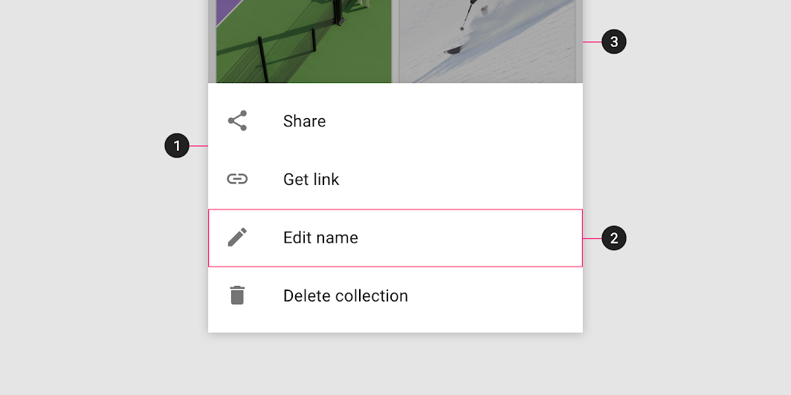

<!--docs:
title: "Material sheets: bottom"
layout: detail
section: components
excerpt: "Bottom sheets are surfaces containing supplementary content that are anchored to the bottom of the screen."
iconId: 
path: /catalog/material-sheets-bottom/
-->

# Sheets: bottom

[Bottom sheets](https://material.io/components/sheets-bottom) are surfaces containing supplementary content that are anchored to the bottom of the screen.

## Contents

* [Using bottom sheets](#using-bottom-sheets)
* [Installing bottom sheets](#installing-bottom-sheets)
* [Making bottom sheets accessible](#making-bottom-sheets-accessible)
* [Standard bottom sheet](#standard-bottom-sheet)
* [Modal bottom sheet](#modal-bottom-sheet)
* [Expanding bottom sheet](#expanding-bottom-sheet)
* [Theming bottom sheets](#theming-bottom-sheets)

## Using bottom sheets

Bottom sheets are supplementary surfaces primarily used on mobile. 

### Installing bottom sheets

### Making bottom sheets accessible

### Sheet

### Contents

### Scrim (Modal only)

## Types

There are three types suitable for different use cases: 1. [Standard bottom sheets](#standard-bottom-sheet) display content that complements the screen’s primary content and remain visible while users interact with the primary content, 2. [Modal bottom sheets](#modal-bottom-sheet) are an alternative to inline menus or simple dialogs on mobile and provide room for additional items, longer descriptions, and iconography, and must be dismissed in order to interact with the underlying content, and 3. [Expanding bottom sheets](#exapnding-bottom-sheet) provide a small, collapsed surface that can be expanded by the user to access a key feature or task to offer the persistent access of a standard sheet with the space and focus of a modal sheet.

## Standard bottom sheet

Standard bottom sheets co-exist with the screen’s main UI region and allow for simultaneously viewing and interacting with both regions. They are commonly used to keep a feature or secondary content visible on screen when content in main UI region is frequently scrolled or panned.

### Standard bottom sheet example

## Modal bottom sheet

Modal bottom sheets present a set of choices while blocking interaction with the rest of the screen. They are an alternative to inline menus and simple dialogs on mobile, providing additional room for content, iconography, and actions.

Modal bottom sheets are used in mobile apps only.

### Modal bottom sheet example

## Anatomy and key properties

The following shows the anatomy of a bottom sheet:

1. Sheet
2. Contents
3. Scrim (Modal only)

## Expanding bottom sheet

An expanding bottom sheet is a surface anchored to the bottom of the screen that users can expand to access a feature or task. It can be used for:

* **Persistently displaying a cross-app feature**, such as a shopping cart
* **Collecting and acting on user selections** from a set of items, such as photos in a gallery
* **Supporting tasks**, such as chat and comments
* **Indirect navigation between items**, such as videos in a playlist

Expanding bottom sheets are recommended for use on mobile and tablet.

### Expanding bottom sheet example

## Theming bottom sheets
