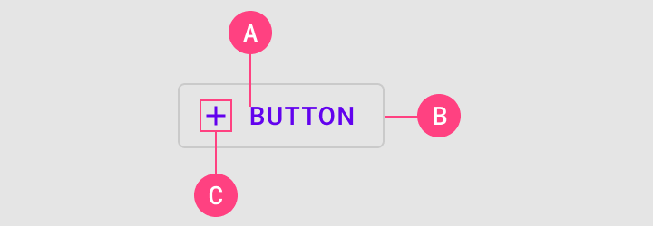

# Android button elements table for outlined button

The following examples show tables for the Android outlined button with asset attributes in separate tables vs asset attributes in one table.

* [Multiple tables](#outlined-button-assets-mulitple-tables)
* [Single table](#outlined-button-assets-single-table)

## Outlined button elements, multiple tables

### Anatomy and key properties

An outlined button has a text label, a stroked container and an optional icon.

<b>Text label</b> attributes

 

|  | Attribute | Related method(s) | Default value |
| --- | --- | --- | --- |
| **Text label** | `android:text` | `setText` `getText` | `null` |
| **Color** | `android:textColor` | `setTextColor` `getTextColor` | `?attr/colorPrimary` |
| **Typography** | `android:textAppearance` | `setTextAppearance` | `?attr/textAppearanceButton` |

<b>Container</b> attributes

 

|  | Attribute | Related method(s) | Default value |
| --- | --- | --- | --- |
| **Color** | `app:backgroundTint` | `setBackgroundColor` `setBackgroundTintList` `getBackgroundTintList` | `@android:color/transparent` |
| **Stroke color** | `app:strokeColor` | `setStrokeColor` `setStrokeColorResource` `getStrokeColor` | `?attr/colorOnSurface` at 12% opacity |
| **Stroke width** | `app:strokeWidth` | `setStrokeWidth` `setStrokeWidthResource` `getStrokeWidth` | `1dp` |
| **Shape** | `app:shapeAppearance` | `setShapeAppearanceModel` `getShapeAppearanceModel` | `?attr/shapeAppearanceSmallComponent` |
| **Elevation** | `app:elevation` | `setElevation` `getElevation` | `0dp` |
| **Ripple color** | `app:rippleColor` | `setRippleColor` `setRippleColorResource` `getRippleColor` | `?attr/colorPrimary` at 12% opacity (pressed) |

<b>Icon</b> attributes

 

|  | Attribute | Related method(s) | Default value |
| --- | --- | --- | --- |
| **Icon** | `app:icon` | `setIcon` `setIconResource` `getIcon` | `null` |
| **Color** | `app:iconTint` | `setIconTint` `setIconTintResource` `getIconTint` | `?attr/colorPrimary` |
| **Size** | `app:iconSize` | `setIconSize` `getIconSize` | `wrap_content` |
| **Gravity** (position relative to text label) | `app:iconGravity` | `setIconGravity` `getIconGravity` | `start` |
| **Padding** (space between icon and text label) | `app:iconPadding` | `setIconPadding` `getIconPadding` | `4dp` |

<b>Styles</b>

 

|  | Style |
| --- | --- |
| **Default style** | `Widget.MaterialComponents.Button.OutlinedButton` |
| **Icon style** | `Widget.MaterialComponents.Button.OutlinedButton.Icon` |

Default style theme attribute: `?attr/materialButtonOutlinedStyle`

See the full list of [styles](https://github.com/material-components/material-components-android/blob/master/lib/java/com/google/android/material/button/res/values/styles.xml) and [attrs](https://github.com/material-components/material-components-android/blob/master/lib/java/com/google/android/material/button/res/values/attrs.xml).

## Outlined button elements, single table 
### Anatomy and key properties

An outlined button has a text label, a stroked container and an optional icon.

<b>Attributes</b>

 

|   | Attribute | Related method(s) | Default value |
|  --- | --- | --- | --- |
| **Text label** | `android:text` | `setText` `getText` | `null` |
| **Text label color** | `android:textColor` | `setTextColor` `getTextColor` | `?attr/colorPrimary` |
| **Text label typography** | `android:textAppearance` | `setTextAppearance` | `?attr/textAppearanceButton` |
| **Container color** | `app:backgroundTint` | `setBackgroundColor` `setBackgroundTintList` `getBackgroundTintList` | `@android:color/transparent` |
| **Container stroke color** | `app:strokeColor` | `setStrokeColor` `setStrokeColorResource` `getStrokeColor` | `?attr/colorOnSurface` at 12% opacity |
| **Container stroke width** | `app:strokeWidth` | `setStrokeWidth` `setStrokeWidthResource` `getStrokeWidth` | `1dp` |
| **Container shape** | `app:shapeAppearance` | `setShapeAppearanceModel` `getShapeAppearanceModel` | `?attr/shapeAppearanceSmallComponent` |
| **Container elevation** | `app:elevation` | `setElevation` `getElevation` | `0dp` |
| **Container ripple color** | `app:rippleColor` | `setRippleColor` `setRippleColorResource` `getRippleColor` | `?attr/colorPrimary` at 12% opacity (pressed) |
| **Icon** | `app:icon` | `setIcon` `setIconResource` `getIcon` | `null` |
| **Icon color** | `app:iconTint` | `setIconTint` `setIconTintResource` `getIconTint` | `?attr/colorPrimary` |
| **Icon size** | `app:iconSize` | `setIconSize` `getIconSize` | `wrap_content` |
| **Icon gravity** (position relative to text label) | `app:iconGravity` | `setIconGravity` `getIconGravity` | `start` |
| **Icon padding** (space between icon and text label) | `app:iconPadding` | `setIconPadding` `getIconPadding` | `4dp` |

<b>Styles</b>

 

|  | Style |
| --- | --- |
| **Default style** | `Widget.MaterialComponents.Button.OutlinedButton` |
| **Icon style** | `Widget.MaterialComponents.Button.OutlinedButton.Icon` |

Default style theme attribute: `?attr/materialButtonOutlinedStyle`

See the full list of [styles](https://github.com/material-components/material-components-android/blob/master/lib/java/com/google/android/material/button/res/values/styles.xml) and [attrs](https://github.com/material-components/material-components-android/blob/master/lib/java/com/google/android/material/button/res/values/attrs.xml).

