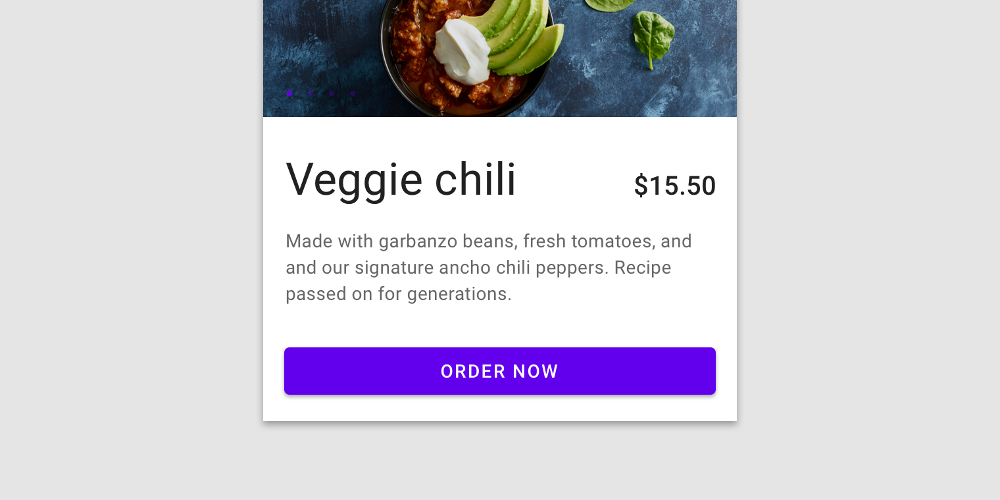

<!--docs:
title: "Example Article: Android Button"
layout: detail
section: components
excerpt: "This is an example of the Android Material Button developer article for material.io. It uses the template from [../article-component-template.md]"
iconId:
path: /
api_doc_root:
-->

# Buttons

Buttons allow users to take actions and make choices with a single tap. Buttons can be customized to meet your style requirements.

For more information, go to the [Buttons](https://material.io/components/buttons/#usage) guidance page.

## Button variants

1. [Text button](#text-button)
2. [Outlined button](#outlined-button)
3. [Contained button](#contained-button)
4. [Toggle button](#toggle-button)


## Using buttons

Before you can use buttons on Android, you need to depend on the Material Components for Android library. For more information, go to the [getting started](https://github.com/material-components/material-components-android/blob/master/docs/getting-started.md) page.

### Add a `MaterialButton` to your XML layout

All standalone button variants on Android are implemented with the [`MaterialButton`](https://developer.android.com/reference/com/google/android/material/button/MaterialButton) class.

They can be added to an XML layout:
```xml
<com.google.android.material.button.MaterialButton
    android:id="@+id/button"
    android:layout_width="wrap_content"
    android:layout_height="wrap_content"
    android:text="Button"
/>
```

_**Note:** it is also acceptable to simply use the `<Button>` XML tag. This will be automatically inflated as a `MaterialButton` by [`MaterialComponentsViewInflater`](https://developer.android.com/reference/com/google/android/material/theme/MaterialComponentsViewInflater), provided a `Theme.MaterialComponents.*` theme is in use._

### Use a style to enable a variant

In order to achieve a certain button variant, you need to use a style:
```xml
<com.google.android.material.button.MaterialButton
    ...
    style="@style/Widget.MaterialComponents.Button.*"
/>
```

The available styles are mentioned below in the button variant sections. If no style is specified, the contained button variant is the default.

To view the full list of available styles, go to the [`MaterialButton` styles](https://github.com/material-components/material-components-android/blob/master/lib/java/com/google/android/material/button/res/values/styles.xml).

### Use theme attributes to set default variant styles

A consistent style for all buttons of a certain variant can be applied with theme attributes. These can reference existing variant styles or a custom style you have defined.

Description | Attribute | Related style(s)
---|---|---
Contained button style | `materialButtonStyle` | `Widget.MaterialComponents.Button.*`
Outlined button style | `materialButtonOutlinedStyle` | `Widget.MaterialComponents.Button.OutlinedButton.*`
Toggle button style | `materialButtonToggleGroupStyle` | `Widget.MaterialComponents.MaterialButtonToggleGroup`

These attributes can be overridden in a `Theme.MaterialComponents.*` theme:
```xml
<style name="Theme.App" parent="Theme.MaterialComponents.*">
    ...
    <item name="materialButtonStyle">@style/Widget.App.Button</item>
    <item name="materialButtonOutlinedStyle">@style/Widget.App.Button.OutlinedButton</item>
    <item name="materialButtonToggleGroupStyle">@style/Widget.App.MaterialButtonToggleGroup</item>
</style>
```

They can also be used to apply styles to individual buttons:
```xml
<com.google.android.material.button.MaterialButton
    ...
    style="?attr/materialButtonOutlinedStyle"
/>
```

### `MaterialButton` attributes

Description | Attribute(s) | Related method(s)
---|---|---
Container color | `app:backgroundTint`<br/>`app:backgroundTintMode` | `setBackgroundColor`<br/>`setBackgroundTintList`<br/>`getBackgroundTintList`<br/>`setBackgroundTintMode`<br/>`getBackgroundTintMode`
Container stroke color | `app:strokeColor` | `setStrokeColor`<br/>`setStrokeColorResource`<br/>`getStrokeColor`
Container stroke width | `app:strokeWidth` | `setStrokeWidth`<br/>`setStrokeWidthResource`<br/>`getStrokeWidth`
Container shape | `app:shapeAppearance` | `setShapeAppearanceModel`<br/>`getShapeAppearanceModel`
Container elevation | `app:elevation` | `setElevation`<br/>`getElevation`
Text label | `android:text` | `setText`<br/>`getText`
Text label color | `android:textColor` | `setTextColor`<br/>`getTextColor`
Text label typography | `android:textAppearance` | `setTextAppearance`
Icon | `app:icon` | `setIcon`<br/>`setIconResource`<br/>`getIcon`
Icon color | `app:iconTint`<br/>`app:iconTIntMode` | `setIconTint`<br/>`setIconTintResource`<br/>`getIconTint`<br/>`setIconTintMode`<br/>`getIconTintMode`
Icon size | `app:iconSize` | `setIconSize`<br/>`getIconSize`
Icon gravity (position relative to text label) | `app:iconGravity` | `setIconGravity`<br/>`getIconGravity`
Icon padding (space between icon and text label) | `app:iconPadding` | `setIconPadding`<br/>`getIconPadding`
Ripple color | `app:rippleColor` | `setRippleColor`<br/>`setRippleColorResource`<br/>`getRippleColor`

To view the full list of available atttributes, go to the [`MaterialButton` attrs](https://github.com/material-components/material-components-android/blob/master/lib/java/com/google/android/material/button/res/values/attrs.xml).

### `MaterialButton` methods

Description | Method(s)
---|---
Listen for press | `setOnClickListener`<br/>`setOnLongClickListener`

To view the full list of available methods, go to the [`MaterialButton` API](https://developer.android.com/reference/com/google/android/material/button/MaterialButton#public-methods_1).

### Use `MaterialButtonToggleGroup` for toggle buttons

Toggle buttons are implemented by grouping `MaterialButton`s using the [`MaterialButtonToggleGroup`](https://developer.android.com/reference/com/google/android/material/button/MaterialButtonToggleGroup) class:

```xml
<com.google.android.material.button.MaterialButtonToggleGroup
    android:id="@+id/toggleButton"
    android:layout_width="wrap_content"
    android:layout_height="wrap_content">

    <com.google.android.material.button.MaterialButton
        android:id="@+id/button1"
        android:layout_width="wrap_content"
        android:layout_height="wrap_content"
        android:text="Button 1"
        style="?attr/materialButtonOutlinedStyle"
    />

    <com.google.android.material.button.MaterialButton
        android:id="@+id/button2"
        android:layout_width="wrap_content"
        android:layout_height="wrap_content"
        android:text="Button 2"
        style="?attr/materialButtonOutlinedStyle"
    />
    
    <com.google.android.material.button.MaterialButton
        android:id="@+id/button3"
        android:layout_width="wrap_content"
        android:layout_height="wrap_content"
        android:text="Button 3"
        style="?attr/materialButtonOutlinedStyle"
    />
    
    ...

</com.google.android.material.button.MaterialButtonToggleGroup>
```

_**Note:** it is recommended that the outline button variant style is applied to the child `MaterialButton`s._

### `MaterialButtonToggleGroup` attributes

Description | Attribute(s) | Related method(s)
---|---|---
Single selection behavior toggle | `app:singleSelection` | `isSingleSelection`<br/>`setSingleSelection`
Default selected button ID | `app:checkedButton` | `check`<br/>`getCheckedButtonId`

To view the full list of available atttributes, go to the [`MaterialButtonToggleGroup` attrs](https://github.com/material-components/material-components-android/blob/master/lib/java/com/google/android/material/button/res/values/attrs.xml).

### `MaterialButtonToggleGroup` methods

Description | Method(s)
---|---
Listen for child button selection (see [`OnButtonCheckedListener`](https://developer.android.com/reference/com/google/android/material/button/MaterialButtonToggleGroup.OnButtonCheckedListener.html)) | `addOnButtonCheckedListener`<br/>`removeOnButtonCheckedListener`<br/>`clearOnButtonCheckedListeners`
Determine selected child button(s) | `getCheckedButtonId`<br/>`getCheckedButtonIds`
Programmatically select child button | `check`<br/>`uncheck`<br/>`clearChecked`
Programmatically add child button | `addView`

To view the full list of available methods, go to the [`MaterialButtonToggleGroup` API](https://developer.android.com/reference/com/google/android/material/button/MaterialButtonToggleGroup#public-methods_1).

### Text button

Text buttons are typically used for less-pronounced actions, including those located:
* In dialogs.
* In cards, text buttons help maintain an emphasis on card content.


#### Relevant styles

Description | Style(s)
---|---
Default text button style | `Widget.MaterialComponents.Button.TextButton`
Text button style (when icon is present) | `Widget.MaterialComponents.Button.TextButton.Icon`
Text button style for snackbar | `Widget.MaterialComponents.Button.TextButton.Snackbar`
Text button style for dialog | `Widget.MaterialComponents.Button.TextButton.Dialog`
Text button style for dialog (no leading margin) | `Widget.MaterialComponents.Button.TextButton.Dialog.Flush`
Text button style for dialog (when icon is present) | `Widget.MaterialComponents.Button.TextButton.Dialog.Icon`

### Outlined button

Outlined buttons are medium-emphasis buttons. They contain actions that are important, but aren’t the primary action in an app.


#### Relevant styles

Description | Style(s)
---|---
Default outlined button style | `Widget.MaterialComponents.Button.OutlinedButton`
Outlined button style (when icon is present) | `Widget.MaterialComponents.Button.OutlinedButton.Icon`

### Contained button

Contained buttons are high-emphasis, distinguished by their use of elevation and fill. They contain actions that are primary to your app.



#### Relevant styles

Description | Style(s)
---|---
Default contained button style | `Widget.MaterialComponents.Button`
Contained button style (when icon is present) | `Widget.MaterialComponents.Button.Icon`
Contained button style with no elevation | `Widget.MaterialComponents.Button.UnelevatedButton`
Contained button style with no elevation (when icon is present) | `Widget.MaterialComponents.Button.UnelevatedButton.Icon`

_**Note:** `*.Icon` styles adjust padding slightly to achieve a better visual balance. This style should only be used with a start-gravity icon. If your icon is end-gravity, mirror the padding such that this adjustment happens on the other side. This applies to all button variants._


### Toggle button

Toggle buttons can be used to group related options. To emphasize groups of related toggle buttons, a group should share a common container.


#### Relevant styles

Description | Style(s)
---|---
Default toggle button style | `Widget.MaterialComponents.MaterialButtonToggleGroup`
