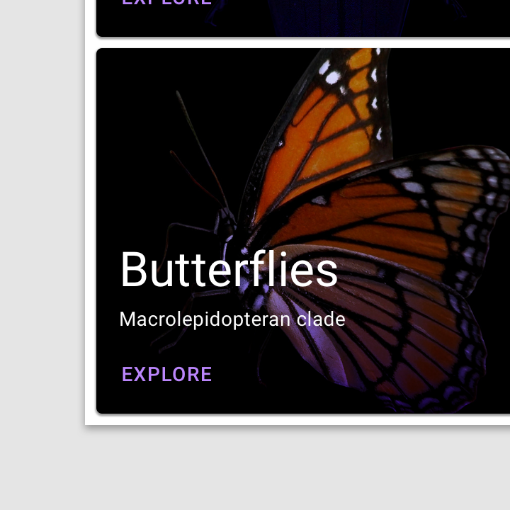

<!--docs:
title: "Example Article: iOS Button"
layout: detail
section: components
excerpt: "This is an example of the iOS Button developer article for material.io. It uses the template from [../article-component-template.md]"
iconId: 
path: /
api_doc_root: 
-->

# MDCButtons (Buttons)

`MDCButtons` is a customizable button component with updated visual styles. This button component has several built-in styles to support diffe/nt levels of emphasis, as typically any UI will contain a few different buttons to indicate different actions, and also supports [floating buttons](link to floating buttons here). 

## MDCButttons variants

1. [Text button](#text-button)
1. [Outlined button](#outlined-button)
1. [Contained button (Filled and raised)](#contained-button)


## Using `MDCButtons`

The `MDCButtons` component provides a complete implementation of Material Design’s button component.

Before using the `MDCButtons` component to implements its variants you must install. In your source files import the component, and then apply your theme:
 1. Install `MDCButtons`
     * Use CocoaPods to install `MDCButtons`
       1. Add the following to your `Podfile`:
         ```bash
        pod MaterialComponents/Buttons
         ```
       1. Run the installer:
         ```bash
         pod install
         ```
 1. Import `MDCButtons` and MDC buttons theming and initialize `MDCButtons` using `alloc`/`init`. Include :
       
       **Swift**
       ```swift
       import MaterialComponents.MaterialButtons
       import MaterialComponents.MaterialButtons_Theming
       ...
        let button = MDCButton()
       ```
       **Objective-C**
       ```obj-c
       #import "MaterialButtons.h"
       #import <MaterialComponentsBeta/MaterialButtons+Theming.h>
       ...
       
       MDCButton *button = [[MDCButton alloc] init];
       ```

### Related APIs

#### MDCButton classes

* [Material Design guidelines: Buttons](https://material.io/go/design-buttons)
* [MDCRaisedButton](https://material.io/components/ios/catalog/buttons/api-docs/Classes.html#/c:objc(cs)MDCRaisedButton)
* [MDCButton](https://material.io/components/ios/catalog/buttons/api-docs/Classes/MDCButton.html)

#### MDCButton enumerations
* [Enumerations](material.io/components/ios/catalog/buttons/api-docs/Enums.html)


------------
**Update the following**
### Text button

The `TextButton` style has a transparent background with text in `colorPrimary`. Text buttons are used for low-priority actions, especially when presenting multiple options.



Attribute | Attribute value | Element description
---|---|---
 android:id | `"@+id/material_text_button"` | 
 style | `"@style/Widget.MaterialComponents.Button.TextButton"` </br> `"@style/Widget.MaterialComponents.Button.TextButton.Icon"` | 
 android:layout_width | `"wrap_content" ` |
 android: layout_height | `"wrap_content"` |
 android:text | `"@string/text_button_label_enabled"`| 

#### Text button example
```xml
 <com.google.android.material.button.MaterialButton
    android:id="@+id/material_text_button"
    style="@style/Widget.MaterialComponents.Button.TextButton"
    android:layout_width="wrap_content"
    android:layout_height="wrap_content"
    android:text="@string/text_button_label_enabled"/>
```
### Outlined button

The `OutlinedButton` style has a transparent background with text color in `colorPrimary`, and a small stroke around the button. Outlined buttons are medium-emphasis buttons. They contain actions that are important, but aren’t the primary action in an app.


 Attribute | Attribute value | Element description 
---|---|--- 
 android:id | `"@+id/material_text_button"` | 
 style | `"@style/Widget.MaterialComponents.Button.TextButton"` </br>`"@style/Widget.MaterialComponents.Button.OutlinedButton.Icon"` | 
 android:layout_width | `"wrap_content"`| 
 android: layout_height | `"wrap_content"`| 
 android:text | `"@string/text_button_label_enabled"` |  

#### Outlined button example
```xml
<com.google.android.material.button.MaterialButton
    android:id="@+id/material_text_button"
    style="@style/Widget.MaterialComponents.Button.OutlinedButton"
    android:layout_width="wrap_content"
    android:layout_height="wrap_content"
    android:text="@string/outlined_button_label_enabled"/>
```
### Contained button
The contained button is an elevated button with a background color in `colorPrimary` and text color in `colorOnPrimary`. This should be used for important, final actions that complete a flow, like ‘Save’ or ‘Confirm’. This style is the default and will be used if no style attribute is specified for a `MaterialButton`.

**Note** Elevated `MaterialButtons` have a shadow that can extend outside the bounds of the button. For this reason, the wrapping parent element should set to `android:clipToPadding="false"` in cases where the button shadow could be clipped by the parent bounds.


Attribute | Attribute value | Element description 
---|---|---
android:id | `"@+id/material_button"` | 
style | `"@style/Widget.MaterialComponents.Button"` </br> `"@style/Widget.MaterialComponents.Button.Icon"` </br> `"@style/Widget.MaterialComponents.Button.UnelevatedButton"` </br> `"@style/Widget.MaterialComponents.Button.UnelevatedButton.Icon"` | 
android:layout_width | `"wrap_content"` | 
android: layout_height | `"wrap_content"`| 
android:text | `"@string/text_button_label_enabled"` |  

#### Contained button example
```xml
<com.google.android.material.button.MaterialButton
    android:id="@+id/material_button"
    style="@style/Widget.MaterialComponents.Button"
    android:layout_width="wrap_content"
    android:layout_height="wrap_content"
    android:text="@string/button_label_enabled"/>
```

#### Contained button example with wrapping parent element `GridLayout`

```xml
<GridLayout
      android:id="@+id/grid"
      android:layout_width="match_parent"
      android:layout_height="wrap_content"
      android:layout_gravity="center"
      android:padding="16dp"
      android:clipToPadding="false"
      android:columnCount="2">

    <com.google.android.material.button.MaterialButton
        android:id="@+id/material_button"
        android:layout_width="wrap_content"
        android:layout_height="wrap_content"
        android:text="@string/button_label_enabled"/>

    <Space/>
  </GridLayout>
```

   
## Examples

<details>
  <summary><b>Add a filled and elevated button</b></summary>
  
 The following code adds a filled and elevated button to your app. Your theme's `colorPrimary` is the default background color and your theme's `colorOnPrimary` is the default text color.
   ```xml
    <com.google.android.material.button.MaterialButton
      android:id="@+id/material_button"
      android:layout_width="wrap_content"
      android:layout_height="wrap_content"
      android:text="@string/button_label_enabled"/>
  ```
</details>

<details>
<summary><b>Add a filled and unelevated button</b></summary>
 The following code adds a filled and unelevated button. Your theme's `colorPrimary` is the default background color and your theme's `colorOnPrimary` is the default text color.
  ```xml
    <com.google.android.material.button.MaterialButton
      android:id="@+id/disabled_material_button"
      android:layout_width="wrap_content"
      android:layout_height="wrap_content"
      android:enabled="false"
      android:text="@string/button_label_disabled"/>
  ```
  
</details>
  
