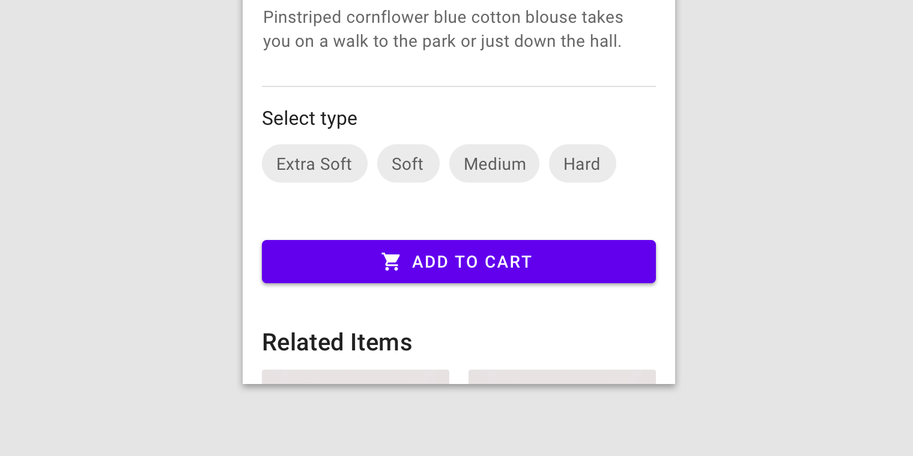

<!--docs:
title: "Example article: Web button"
layout: detail
section: components
excerpt: "This is an example of the Web Material Button developer article for material.io. It uses the template from [../article-component-template.md]"
iconId: 
path: /
api_doc_root: 
-->
# Buttons (`mdc-buttons`)

`mdc-buttons` is a customizable button component with updated visual styles. This button component has several built-in styles to support different levels of emphasis, as typically any UI will contain a few different buttons to indicate different actions. 

## Material button variants

1. [Outlined button](#outlined-button)
1. [Contained button](#contained-button)


## Using `mdc-buttons`

The `mdc-buttons` component provides a complete implementation of Material Design’s button component. 

=========================
**Update the following**

### Related APIs

#### Material button element

 Go  to the [Android MaterialButton API](https://developer.android.com/reference/com/google/android/material/button/MaterialButton) for more details.
```xml
<com.google.android.material.button.MaterialButton
  android:<property>="<property value>"
   ...
   style="@style/widget.MaterialComponents.<style value>"
/>
```
#### Material button attributes without icons

Attribute | Description | Possible values
---|---|---
`android:id` | | `"@+id/material_button"` </br> `"@+id/disabled_material_button"` </br> `"@+id/material_unelevated_button"`
`android:layout_width` | | `"wrap_content"`
`android:layout_height` | | `"wrap_content"`
`android:enabled` | | `true`\|`false`
`android:text` | | `"@string/button_label_enabled"`</br> `"@string/button_label_disabled"`
`style`| |`"@style/Widget.MaterialComponents.Button.UnelevatedButton"` </br> `"@style/Widget.MaterialComponents.Button.TextButton"`

#### Material button attributes with icons

The .Icon style should only be used for start-gravity icon buttons. If your icon is end-gravity, you cannot use a .Icon style and must instead manually adjust your padding such that the visual adjustment is mirrored.


 
Attribute | Description | Possible values
---|---|---
`android:id` |  | `"@+id/material_icon_button"` </br> `"@+id/disabled_icon_material_button"` </br> `"@+id/material_icon_unelevated_button"`
`android:layout_width` |  | `"wrap_content"`
`android:layout_height` |  | `"wrap_content"`
`android:enabled` |  | `true`\|`false`
`android:text` |  | `"@string/icon_button_label_enabled"`</br> `"@string/icon_button_label_disabled"`
`app:icon` | adds an icon to the button | `"@drawable/icon_24px"`
`style`|  | `"@style/Widget.MaterialComponents.Button.Icon"` </br> `"@style/Widget.MaterialComponents.Button.TextButton.Icon"`


### \[Component section\]
Divide the component API into categories according to its TOC on its corresponsoding material.io/components page. Following a similar outline will help cross-link the pages between the design documents and the developer pages. You can skip **Theming** and **Specs** sections unless the component APIs deal specifically with either.

For example [buttons](material.io/components/buttons/) is divided into the following 3rd tier sections based on its variants:

* Text button
* Outlined button
* Contained button
* Toggle button


Whereas [cards](https://material.io/components/cards/) is divided into:

* Behavior
* Actions
* Card collections


Each section should have a 3rd tier header. Within each section, there should be a table that contains:
* an image of the section topic
* a general description
* classes, parameters, enums related to the section
* links the applicable API(s) if there any specific to the section. 


If possible, each section should have its own example(s) with code snippets/settings relevant to the section and an image showing what the code could generate.

**Example: iOS button**

> 
> ### iOS Text button
> 
>
> 
>
> Attribute | Attribute value | Element description 
> ---|---|---
>  underlyingColorHint | hex (?) |Determines a button's background color and surrounding area. 
>
> #### Text button example
> **Swift**
> ```swift
> let button = MCDButton()
> ```
> **Objective-C**
> ```obj-c
> MDCButton *button = [[MDCButton alloc] init];
> ```
>
> ### iOS Outlined button
> ...
>
> ### iOS Contained button
> ...
> ### iOS Toggle button
> ...


**Example: Android Button**

> ### Android text button
>
> 
> The `TextButton` style has a transparent background with colored text. Text buttons are used for low-priority actions, especially when presenting multiple options.
>
> Attribute | Attribute value | Element description
> ---|---|---
> android:id | `"@+id/material_text_button"` | 
> style | `"@style/Widget.MaterialComponents.Button.TextButton"` | 
> android:layout_width | `"wrap_content" ` |
> android: layout_height | `"wrap_content"` |
> android:text | `"@string/text_button_label_enabled"`| 
>
> #### Android text button example
> ```xml
>  <com.google.android.material.button.MaterialButton
>    android:id="@+id/material_text_button"
>    style="@style/Widget.MaterialComponents.Button.TextButton"
>    android:layout_width="wrap_content"
>    android:layout_height="wrap_content"
>    android:text="@string/text_button_label_enabled"/>
>```
>
> ...
>

   
## Example: \[Describe a way to use the Component\]
* What functions/objects does it use?
* How does the example use the objects/functions?
* Are there any special settings/options used in this example, and why?
* Provide an image of what the example could produce. Mention any themes/settings used.

<details>
  <summary><b>Click to View Examples without Steps</b></summary>
  
  Describe the example and its components, including specific settings and instructions.
  
  > ### Example: Add a contained (filled) and elevated button
  > The following code adds a contained and elevated button to your app. Your theme's `colorPrimary` is the default background color and your theme's `colorOnPrimary` is the default text color.
  > 
  >   ```xml
  >    <com.google.android.material.button.MaterialButton
  >      android:id="@+id/material_button"
  >      android:layout_width="wrap_content"
  >      android:layout_height="wrap_content"
  >      android:text="@string/button_label_enabled"/>
  >  ```
  >  ### Example: Add a contained (filled) and unlevated button
  > The following code adds a contained and unelevated button. Your theme's `colorPrimary` is the default background color and your theme's `colorOnPrimary` is the default text color.
  >  ```xml
  >    <com.google.android.material.button.MaterialButton
  >      android:id="@+id/disabled_material_button"
  >      android:layout_width="wrap_content"
  >      android:layout_height="wrap_content"
  >      android:enabled="false"
  >      android:text="@string/button_label_disabled"/>
  >  ```
  
</details>
  
<details>
  <summary><b>Click to View Examples with Steps</b></summary>
  
  If the example entails multiple steps, use a numbered list for each step. Break out iny installation/importation steps into its own list.
 
 List the steps to use the compnent. Include any installation/importation instructions in a separate list.
> ### Add a themed text button
> Follow the steps below to add a text button in your iOS application:
> 
>
> 1. Add the following to your `Podfile`:
>   ```bash
>   pod 'MaterialComponents/Buttons'
>   ```
> 2. Run the `install` command:
>   ```bash
>    pod install
>    ```
> 3. In your source file, you will need to:
>    * import `MaterialButtons`
>      ```swift
>        import MaterialComponents.MaterialButtons
>      ```
>    * import `MaterialButtons_Theming`
>        ```swift
>        import MaterialComponents.MaterialButtons_Theming
>        ```
>    * initialize the button
>        ```swift
>        let button = MDCButton()
>        ```
>    * apply a theme to the text button
>        ```swift
>        button.applyTextTheme(withScheme: containerScheme)
>        ```

</details>
