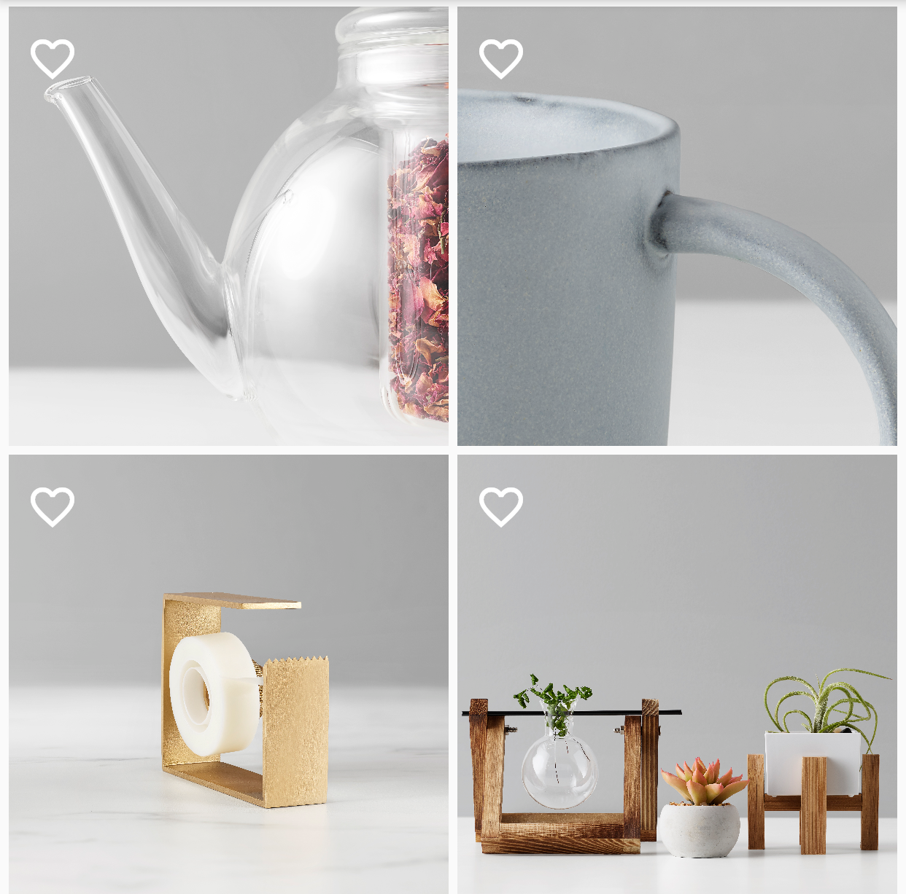

<!--docs:
title: "Example article: Flutter button"
layout: detail
section: components
excerpt: "This is an example of the Flutter Material Button developer article for material.io. It uses the template from [../dev-article-template.md]"
iconId:
path: /
api_doc_root:
@import "@material/button/mdc-button";
-->
# Buttons

Buttons allow users to take actions, and make choices, with a single tap.

The buttons component for the material.io web platform consists of the following implementations are extensions of the [MaterialButton](https://api.flutter.dev/flutter/material/MaterialButton-class.html), [StatelessWidget](https://api.flutter.dev/flutter/widgets/StatefulWidget-class.html), and [Widget](https://api.flutter.dev/flutter/widgets/Widget-class.html) classes:

* [MaterialButton](https://api.flutter.dev/flutter/material/MaterialButton-class.html)
  * [Text Button](#text-button) (FlatButton)
  * [Outlined Button](#outlined-button) (OutlineButton)
  * [Contained Button](#contained-button) (RaisedButton)
* [StatelessWidget](https://api.flutter.dev/flutter/widgets/StatefulWidget-class.html) 
  * [Toggle Bar](#toggle-bar) (ToggleButtons)
* [Widget](https://api.flutter.dev/flutter/widgets/Widget-class.html)
  * [Toggle Icon Button](#toggle-icon) (IconButton)

For more information on the button component, visit [material.io/components/buttons](http://material.io/components/buttons).

# Using Buttons

## Text button

Text buttons are typically used for less-pronounced actions, including those located:
* In dialogs
* In cards
In cards, text buttons help maintain an emphasis on card content.

### Text button example

Source Code APIs:

* [FlatButton](https://api.flutter.dev/flutter/material/FlatButton-class.html)

The following example shows a text button with black text on white background.


```dart
FlatButton(
  onPressed: () {
    /*...*/
  },
  child: Text(
    "Flat Button",
    style: TextStyle(fontSize: 20)
  ),
)
```

## Outlined button

Outlined buttons are medium-emphasis buttons. They contain actions that are important, but aren’t the primary action in an app.

### Outlined button example

Source Code APIs:
* [OutlineButton](https://api.flutter.dev/flutter/material/OutlineButton-class.html)


```dart
OutlineButton(
  onPressed() {
    /*...*/
  },
  child: Text(
    "Outlined Button"
     style: TextStyle(fontSize: 20)

  ),
}
```


## Contained button

Contained buttons are high-emphasis, distinguished by their use of elevation and fill. They contain actions that are primary to your app.

### Contained button example

Source Code APIs:

* [RaisedButton](https://api.flutter.dev/flutter/material/RaisedButton-class.html)

The following examples show a contained button. Color schemes are typically determined by your theme.


```dart
RaisedButton(
    onPressed: () {},
    child: const Text(
         'Contained Button',
         style: TextStyle(fontSize: 20)
    ),
),

```

## Toggle button

Toggle buttons can be used to select from a group of choices.

### Toggle Bar

The toggle bar allows you to select from a group of buttons that can be set to [selective action](https://material.io/components/buttons/#toggle-button) where only one button in a group can be selected at one time.

#### Toggle bar with four icons example

Source code APIs:
* [IconButton](https://api.flutter.dev/flutter/material/IconButton-class.html)


The following example displays 4 `IconButton`s in a widget called `buildIconButton`. It uses another widget called `iconWidget` that allows users to toggle an `IconButton`: 


```dart
class ToggleBarDemo extends StatefulWidget {
  ToggleBarDemo({Key key, this.title}) : super(key: key);

  final String title;

  @override
  _ToggleBarDemoState createState() => _ToggleBarDemoState();
}

class _ToggleBarDemoState extends State<ToggleBarDemo> {
  @override
  Widget build(BuildContext context) {
    return Scaffold(
      appBar: AppBar(
        title: Text(widget.title),
        actions: [
          IconButton(
              icon: const Icon(Icons.pages),
              tooltip: 'Change Page',
              onPressed: changePage),
        ],
      ),
      body: Center(
        child: Column(
          mainAxisAlignment: MainAxisAlignment.center,
          children: <Widget>[
            buildIconButton(),
          ],
        ),
      ),
    );
  }

  /// The Routes were set in the main.dart. Navigator is a tool that lets you
  /// access these different routes.
  void changePage() {
    Navigator.of(context).pushReplacementNamed('/toggleIconPage');
  }

  List<bool> isSelected = List<bool>.filled(4, false);
  Widget buildIconButton() {
    return ToggleButtons(
      children: [
        Icon(Icons.aspect_ratio),
        Icon(Icons.assignment_ind),
        Icon(Icons.assignment_late),
        Icon(Icons.bookmark_border),
      ],
      onPressed: (int index) {
        setState(() {
          isSelected[index] = !isSelected[index];
        });
      },
      isSelected: isSelected,
    );
  }
}
```

### Toggle Icon

The [toggle icon](https://material.io/components/buttons/#toggle-button) button allows you to select from a group using an icon. 

#### Toggle icon buttons with background images

Source code APIs:

* [StatefulWidget](https://api.flutter.dev/flutter/widgets/StatefulWidget-class.html)
* [GestureDetector](https://api.flutter.dev/flutter/widgets/GestureDetector-class.html)
* [GridTile](https://api.flutter.dev/flutter/material/GridTile-class.html)
* [GridTileBar](https://api.flutter.dev/flutter/material/GridTileBar-class.html)
* [IconButton](https://api.flutter.dev/flutter/material/IconButton-class.html)
* [IconData](https://api.flutter.dev/flutter/widgets/IconData-class.html)

The following example allows you to select a favorite from a group of photos with a single tap on the icon.

The photos and icon buttons are contained within instances of `GridDemoPhotoItem`, which extends the `GridTile` API. `GridDemoPhotoItem` does the following:

* fits a passed image to `Photo` to the size specified in `GridView`. 
* sets the icon displayed to `on` (`favorite`) or `off` (`favorite_border`) and sets `IconData` as determined by a call to `GestureDetector`.
* sets the icon color to white as opposed to the default black

The `ToggleIconDemoState` class contains the the list of photos that become the backgrounds to the `GridDemoPhotoItem` tiles.



```dart
import 'package:flutter/material.dart';

typedef BannerTapCallback = void Function(Photo photo);

/// Each tile has a photo within it. The photo is used to toggle the
/// icon between on and off.
class Photo {
  Photo({
    this.assetName,
    this.isFavorite = false,
  });

  final String assetName;
  bool isFavorite;
  String get tag => assetName; // Assuming that all asset names are unique.
}

/// This class is each tile within the Grid. It represents the individual items
/// you see. A widget is stateless if we know that the file will not change.
class GridDemoPhotoItem extends StatelessWidget {
  GridDemoPhotoItem({
    Key key,
    @required this.photo,
    @required this.onBannerTap,
  })  : assert(onBannerTap != null),
        super(key: key);

  final Photo photo;
  final BannerTapCallback
      onBannerTap; // User taps on the photo's header or footer.

  @override
  Widget build(BuildContext context) {
    final Widget image = GestureDetector(
      child: Hero(
        key: Key(photo.assetName),
        tag: photo.tag,
        child: Image.asset(
          photo.assetName,
          fit: BoxFit.cover,
        ),
      ),
    );

    final IconData icon =
        photo.isFavorite ? Icons.favorite : Icons.favorite_border;

    return GridTile(
        header: GestureDetector(
          onTap: () {
            onBannerTap(photo);
          },
          child: GridTileBar(
            leading: Icon(
              icon,
              color: Colors.white,
            ),
          ),
        ),
        child: image);
  }
}

/// Toggle Icon Demo is a stateful widget because it is not immutable meaning
/// that the Widget can change State. This widget is changing state each time
/// the user clicks on the Flutter Favorite Icon. Each time the user clicks on
/// that icon this page will build again. This is the reason this class has to
/// extend Stateful Widget.
class ToggleIconDemo extends StatefulWidget {
  ToggleIconDemo({Key key, this.title}) : super(key: key);

  final String title;
  @override
  ToggleIconDemoState createState() => ToggleIconDemoState();
}

class ToggleIconDemoState extends State<ToggleIconDemo> {
  List<Photo> photos = <Photo>[
    Photo(assetName: 'assets/images/img1.jpg'),
    Photo(assetName: 'assets/images/img2.jpg'),
    Photo(assetName: 'assets/images/img3.jpg'),
    Photo(assetName: 'assets/images/img4.jpg'),
  ];

  void changePage() {
    Navigator.of(context).pushReplacementNamed('/toggleBarPage');
  }

  @override
  Widget build(BuildContext context) {
    final Orientation orientation = MediaQuery.of(context).orientation;
    return Scaffold(
      appBar: AppBar(
        title: Text(widget.title),
        actions: [
          IconButton(
              icon: const Icon(Icons.pages),
              tooltip: 'Change Page',
              onPressed: changePage),
        ],
      ),
      body: Column(
        children: [
          Expanded(
            child: SafeArea(
              top: false,
              bottom: false,
              child: GridView.count(
                crossAxisCount: (orientation == Orientation.portrait) ? 2 : 3,
                mainAxisSpacing: 4.0,
                crossAxisSpacing: 4.0,
                padding: const EdgeInsets.all(4.0),
                childAspectRatio:
                    (orientation == Orientation.portrait) ? 1.0 : 1.3,
                children: photos.map<Widget>((Photo photo) {
                  return GridDemoPhotoItem(
                    photo: photo,
                    onBannerTap: (Photo photo) {
                      setState(() {
                        photo.isFavorite = !photo.isFavorite;
                      });
                    },
                  );
                }).toList(),
              ),
            ),
          ),
        ],
      ),
    );
  }
}
 ```
