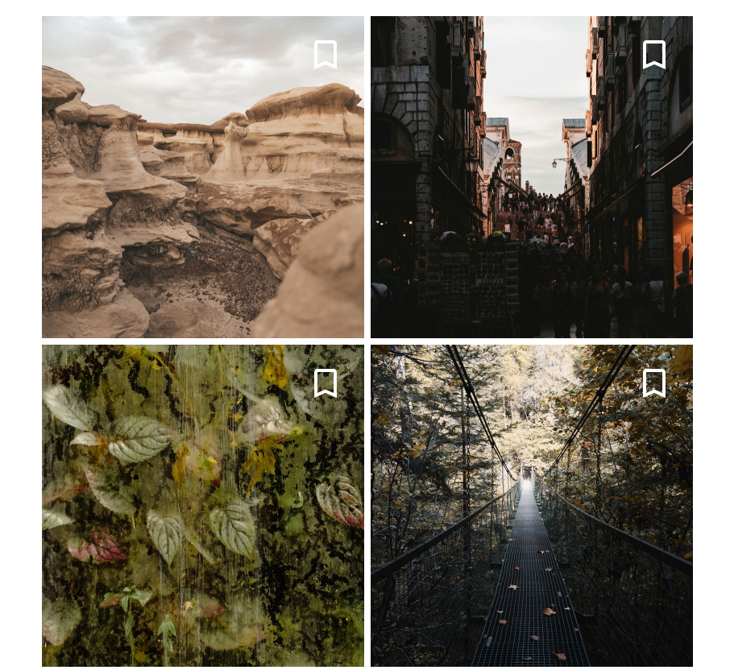

<!--docs:
title: "Example article: Web button"
layout: detail
section: components
excerpt: "This is an example of the Web Material Button developer article for material.io. It uses the template from [../dev-article-template.md]"
iconId:
path: /
api_doc_root:
@import "@material/button/mdc-button";
-->
# Buttons

The buttons component for the material.io web platform consists of two implementations:

* [`mdc-button`](#mdc-button) is a customizable button component with updated visual styles. This button component has several built-in styles to support different levels of emphasis, as typically any UI will contain a few different buttons to indicate different actions. Use `mdc-button` can implement the following material buttons:
  * [Text button](#text-button)
  * [Outline button](#outline-button)
  * [Filled button](#filled-button)
* [`mdc-icon-button`](#mdc-icon-button) is a variant of `mdc-button` that allows users to select and toggle an icon button with a single tap.
  * [Toggle (Icon) button](#icon-button)

You can customize button look and feel using [Sass Mixins](#sass-mixins)

For more information on the buttons component, go to the material.io [Buttons](http://material.io/components/buttons) page.

# Using Buttons

Before you can use a button, you will need to install the following:

* [Material button(s)](#install-mdc-button-or-mdc-icon-button)
* [Add a theme](#add-a-theme)
* [Import JavaScript effects](import-javascript-effects)

### Install `mcd-button` or `mdc-icon-button`
Install the `mdc-button` component before including it in your source.

**`mdc-button`**
```bash
npm install @material/buttons
```

**`mdc-icon-button`**
```bash
npm install @material/icon-button
```

### Add a theme
Both `mdc-button` and `mdc-icon-button` components work with themes (styles). Import a style into your `*.scss*` stylesheet to apply it to your website, including buttons or toggle icon buttons:

**mdc-button**
```css
@import "@material/button/mdc-button";
```

**mdc-icon-button**
```css
@import "@material/icon-button/mdc-icon-button";
```

### Import JavaScript effects
You can also add a JavaScript ripple effect (see [MDC Ripple](https://github.com/material-components/material-components-web/blob/master/packages/mdc-ripple)) to your buttons by importing then instantiating `MCDRipple` in your `*.js` file. See the page on importing the [JavaScript component](https://github.com/material-components/material-components-web/blob/master/docs/importing-js.md) for more information on importing JavaScript.

```js
import {MDCRipple} from '@material/ripple';

<!-- The following line applies to the `mdc-button` class-->
const buttonRipple = new MDCRipple(document.querySelector('.mdc-button'));


<!-- The following line applies to the `mdc-icon-button` class-->
const iconButtonRipple = new MDCRipple(document.querySelector(`.mdc-icon-button`));
iconButtonRipple.unbounded = true;
```

### Add an icon to `mdc-button`

Add an icon to your `mdc-button` instance using the following steps:

1. In your HTML file, reference the font library you would like to use (we recommend the [Material Icons](https://material.io/tools/icons/) from Google Fonts):
    ```HTML
    <head>
      <link rel="stylesheet" href="https://fonts.googleapis.com/icon?family=Material+Icons">
    </head>
    ```
1. Include the `mcd-button__icon` class inside your button element. Set the attribute `area-hidden="true"`.
    **Note** The location of the icon element determines if the icon comes before (*leading*) or after (*trailing icon*) the text.

    **Example using [Material Icons](https://material.io/tools/icons/)**
    ```HTML
    <button class="mdc-button">
      <i class="material-icons mdc-button__icon" aria-hidden="true">favorite</i>
      <span class="mdc-button__label">Button</span>
    </button>
    ```
    **Example using SVG Icons**
    ```html
    <button class="mdc-button">
      <svg class="mdc-button__icon" aria-hidden="true" xmlns="http://www.w3.org/2000/svg" viewBox="...">
        /*...*/
      </svg>
      <span class="mdc-button__label">Button</span>
    </button>
    ```

### Sass mixins

Use Sass mixins when you want to customize the look and feel of your buttons. Go to [sass-lang.com](https://sass-lang.com/install) for installation instructions.

Before using Sass mixins for your project you will need to do the following:

* Add the Sass package to your `*.json file` under `devDependencies`:
```json
"devDependencies": {
  "sass": "^1.14.3"
}
````

* Add a `.sassrc.js` file to your project directory:
```js

const path = require("path");

const CWD = process.cwd();

module.exports = {
  includePaths: [path.resolve(CWD, "node_modules"), path.resolve(CWD, "src")]
};
```

* In your `*.scss` file for your application, create an instance of your button with the Sass mixins settings of your choice. For example, if you have a button :

```css
.button-instance {
  @include mdc-button-container-fill-color(orange);
  @include mdc-button-icon-color(green);
  ...
}
```


#### Sass mixins for `mdc-button`

The following mixins are available to customize your `mdc-button` instance.

Mixin | Description
---|---
`mdc-button-container-fill-color($color)` | Sets the container fill color to the given color.
`mdc-button-icon-color($color)` | Sets the icon color to the given color.
`mdc-button-ink-color($color)` | Sets the ink color to the given color, and sets the icon color to the given color unless `mdc-button-icon-color` is also used.
`mdc-button-shape-radius($radius, $rtl-reflexive)` | Sets rounded shape to button with given radius size. Set `$rtl-reflexive` to true to flip radius values in RTL context, defaults to false.
`mdc-button-horizontal-padding($padding)` | Sets horizontal padding to the given number.
`mdc-button-outline-color($color)` | Sets the outline color to the given color.
`mdc-button-outline-width($width, $padding)` | Sets the outline width to the given number (defaults to 2px) and adjusts padding accordingly. `$padding` is only required in cases where `mdc-button-horizontal-padding` is also included with a custom value.

#### Sass mixins for `mdc-icon-button`

The following mixins are available to customize your `mdc-icon-button` instance.

Mixin | Description
---|---
`mdc-icon-button-size($width, $height, $padding)` | Sets the width, height, font-size and padding for the icon and ripple. `$height` is optional and defaults to `$width`. `$padding` is optional and defaults to `max($width, $height)/2`. `font-size` is set to `max($width, $height)`.
`mdc-icon-button-ink-color($color)` | Sets the font color and the ripple color to the provided color value.

### Text button

Text buttons are typically used for less-pronounced actions, including those located:
* In dialogs
* In cards
In cards, text buttons help maintain an emphasis on card content.


#### Related APIs
[Source code](https://github.com/material-components/material-components-web/tree/master/packages/mdc-button): GitHub source repository<br>
[Demo site](https://glitch.com/~shadow-jobaria): This site contains example code to generate a text button.


#### Text button example


```html
 <button class="mdc-button">
  <span class="mdc-button__label">Text Button</span>
</button>
```

#### Text button with icon example


```html
<button class="mdc-button">
  <i class="material-icons mdc-button__icon" aria-hidden="true"
    >bookmark</i
  >
  <span class="mdc-button__label">Text Button plus icon</span>
</button>
```

### Outlined button

Outlined buttons are medium-emphasis buttons. They contain actions that are important, but aren’t the primary action in an app.


#### Related APIs
[Source code](https://github.com/material-components/material-components-web/tree/master/packages/mdc-button): GitHub source repository<br>
[Demo site](https://glitch.com/~shadow-jobaria): This site contains example code to generate an outlined button.

#### Outlined button example


```html
<button class="mdc-button--outlined">
  <span class="mdc-button__label">Outlined Button</span>
</button>
```

#### Outlined button with icon example


```html
<button class="mdc-button mdc-button--outlined">
  <i class="material-icons mdc-button__icon" aria-hidden="true">bookmark</i>
    <span class="mdc-button__label">Outlined Button plus Icon</span>
</button>
```

### Contained button

Contained buttons are high-emphasis, distinguished by their use of elevation and fill. They contain actions that are primary to your app.


#### Related APIs
[Source code](https://github.com/material-components/material-components-web/tree/master/packages/mdc-button): GitHub source repository<br>
[Demo site](https://glitch.com/~shadow-jobaria): This site contains example code to generate a contained button.

#### Contained button example


```html
<button class="mdc-button--elevated">
  <span class="mdc-button__label">Contained Button</span>
</button>
```

#### Contained button with icon example


```html
<button class="mdc-button mdc-button--raised">
  <i class="material-icons mdc-button__icon" aria-hidden="true"
    >bookmark</i
  >
  <span class="mdc-button__label">Contained Button plus Icon</span>
</button>
```

### Toggle button

Toggle buttons can be used to select from a group of choices.

#### Toggle bar

The Material.io framework for Web currently does not support toggle button groups, such as:


 If your application needs a toggle button group, you will need to use a different framework such as [Vuetify](https://vuetifyjs.com/en/components/button-groups#button-groups).

#### Toggle icon button

The toggle icon button allows you to select from a group using an icon.

##### Toggle icon bar example with background images

[Source code](https://github.com/material-components/material-components-web/tree/master/packages/mdc-icon-button): GitHub source repository<br>
[Demo site](https://glitch.com/~shadow-jobaria): This site contains example code to generate a contained button.


To generate the example with background images of your choosing, you will need to do the following:

* In your `*.scss` file:
  1. Create containers to contain your tiled images:
      ```css
      .container {
        display: flex;
        flex-wrap: wrap;
        max-width: 450px;
        justify-content: center;
      }
      ```
  1. Create containers for your images, with the images cut to fit within the predefined height and width:
      ```css
        image-with-fave {
          position: relative;
          margin: 2px;
        }

        .image-with-fave img {
          width: 200px;
          height: 200px;
          object-fit: cover;
        }
      ```
  1. If your images are dark, then you may need use Sass mixins to change the icon color from the default. For example, you can create an instance of an icon button with white ink instead of the default black:
        ```css
            .fave-button {
              @include mdc-icon-button-ink-color(white);

              position: absolute;
              top: 0;
              right: 0;
            }
        ```
* In your `*.js` file,
    1. Import `MDCIconButtonToggle`:
        ```js
        import {MDCIconButtonToggle} from '@material/icon-button';
        ```
    1. Instantiate the icon button toggle:
        ```js
        const iconToggle = new MDCIconButtonToggle(document.querySelector('.mdc-icon-button'));
        iconToggle.unbounded = true;
        ```
    1. If you want to add a ripple effect to your button press:

        ```js
        import { MDCRipple } from "@material/ripple";
        ...
        const iconButtonRipple = new MDCRipple(document.querySelector('.mdc-icon-button'));
        iconButtonRipple.unbounded = true;
        ```
  * In you `*.html` file, you can now add the iterations of the following, which shows containers with background images:
    ```html
    <div class="container">
          <div class="image-with-fave">
            
            <button
              id="bookmark-0"
              class="mdc-icon-button fave-button"
              aria-label="Add to favorites"
              aria-hidden="true"
              aria-pressed="false"
            >
              <i
                class="material-icons mdc-icon-button__icon mdc-icon-button__icon--on"
                >bookmark</i
              >
              <i class="material-icons mdc-icon-button__icon">bookmark_border</i>
            </button>
          </div>
          <div class="image-with-fave">
            
            <button
              id="bookmark-1"
              class="mdc-icon-button fave-button"
              aria-label="Add to favorites"
              aria-hidden="true"
              aria-pressed="false"
            >
              <i
                class="material-icons mdc-icon-button__icon mdc-icon-button__icon--on"
                >bookmark</i
              >
              <i class="material-icons mdc-icon-button__icon">bookmark_border</i>
              </button>
          </div>
    ```
